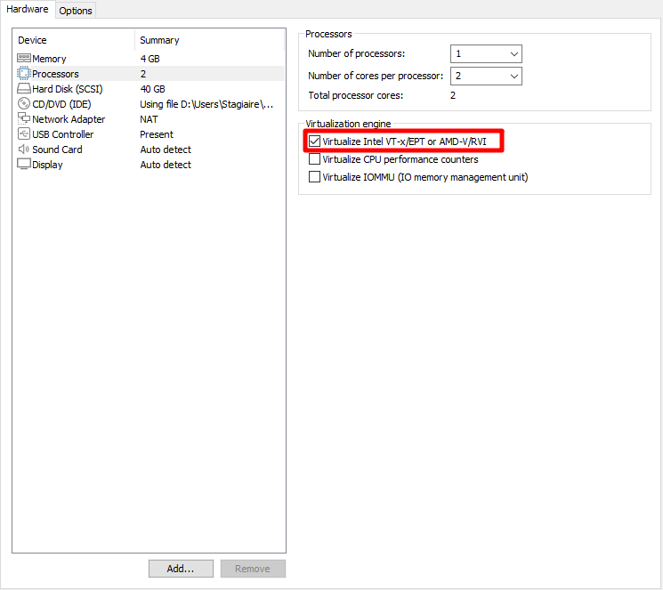

|                       |
| --------------------- |
|                       |
| Mise en place Proxmox |
|                       |

|   |
|---|
|Gautier RAYEROUX – Cyriac FOLENFANT – David GEMAIN  09/03/2026|

Table des matières

[Documentation de la plateforme 2](#_Toc362957592)

[Prise en main de la plateforme 3](#_Toc1915512277)

[Switch 4](#_Toc382586170)

[pfSense 4](#_Toc562610732)

[Mise en place VPN S-to-S 5](#_Toc511668694)

[Installation de Proxmox 5](#_Toc760556230)

[Importer une image ISO 9](#_Toc337202715)

[Création des VMs 10](#_Toc266655056)

[Importer une VM 14](#_Toc1907002992)

[Ajouter un dossier partagé entre la VM Proxmox et l’hôte 15](#_Toc1985239408)

[Créer un point de montage sur la VM Proxmox 15](#_Toc431572589)

[Importer un OVF 16](#_Toc773272253)

[Réseaux Proxmox 16](#_Toc1337741370)

[Définition 17](#_Toc524983741)

[Linux Bridge 17](#_Toc1744565440)

[Linux Bond 17](#_Toc393043129)

[Linux VLAN 17](#_Toc1957673060)

[Configuration par défaut 17](#_Toc210021983)

[Créer un Linux Bridge 18](#_Toc1741113100)

[Créer un Linux VLAN 19](#_Toc709874331)

[Gestion d’utilisateur 21](#_Toc990596506)

[Créer un utilisateur 22](#_Toc1271459323)

[Ajouter des permissions 22](#_Toc1525035481)

[Désactiver SSH du root 22](#_Toc78822089)

[Serveur iSCSI 23](#_Toc872073213)

[Installer targetcli-fb (serveur iSCSI) 24](#_Toc1457089978)

[Lancement de la configuration iSCSI 24](#_Toc1336665255)

[Création du stockage bloc 24](#_Toc667619157)

[Création de la cible iSCSI 24](#_Toc1388889196)

[Vérifier le nom exact de la cible créée 24](#_Toc223553229)

[Création du LUN 25](#_Toc1491231002)

[Autoriser les connexions (mode lab) 25](#_Toc253139861)

[Activer auto ACL 25](#_Toc921990532)

[Vérification configuration 25](#_Toc1574870487)

[Vérification service 25](#_Toc2027199751)

[Connexion de ISCSI sur Proxmox 26](#_Toc1901814627)

[Récupérer l’IQN de proxmox pour l’autoriser à se connecter au serveur iSCSI 27](#_Toc1566449979)

[Ajouter l’ACL avec l’IQN de Proxmox 27](#_Toc511016134)

[Découvrir et connecter Proxmox 27](#_Toc760270297)

[Créer le VG LVM sur Proxmox 27](#_Toc878087552)

[Automatiser la connexion du serveur iSCSI 29](#_Toc1714929378)

[Dépannage 30](#_Toc1051711858)

[HAProxy 30](#_Toc775797518)

[1. Installation du service 31](#_Toc1966936279)

[2. Configuration du fichier haproxy.cfg 31](#_Toc1402513433)

[3.Modifier Apache (sur tes deux serveurs) 31](#_Toc240466468)

[4. Activation et vérification 31](#_Toc110014816)

[Keepalived 31](#_Toc1206133272)

[1. Installation du service 32](#_Toc937244478)

[2. Configuration du serveur MASTER (SRVLX01) 32](#_Toc1066104002)

[3. Configuration du serveur BACKUP (SRVLX02) 32](#_Toc1302501739)

[4. Activation et démarrage 32](#_Toc344976850)

[Sources 33](#_Toc1730306188)

# Documentation de la plateforme

|   |   |   |   |   |   |   |   |   |
|---|---|---|---|---|---|---|---|---|
|Département|VLAN|Ports GE|Réseau|Broadcast|Plage|SVI/Passerelle||   |
|Administration|10|2-10|192.168.10.0 /24|192.168.10.255|192.168.10.2 => 192.168.10.254|192.168.10.1||   |
|Ventes|20|11-17|192.168.20.0 /24|192.168.20.255|192.168.20.2 => 192.168.20.254|192.168.20.1||   |
|IT|30|21|192.168.30.0 /24|192.168.30.255|192.168.30.2 => 192.168.30.253|192.168.30.1||   |
|WiFi|40|23|192.168.40.0 /24|192.168.40.255|192.168.40.2 => 192.168.40.254|192.168.40.1||   |
|Firewall|50|22|192.168.50.0 /24|192.168.50.255||192.168.50.254||   |
|Server|60|19|192.168.240.0 /24|192.168.240.255||192.168.240.1||   |
|Client|70|18|192.168.245.0/24|192.168.245.255||192.168.245.1||   |
|Management|99|20|192.168.255.0/24|192.168.255.255||192.168.255.1||   |
|Par défaut (Native)|100|1|192.168.1.254 /24|192.168.1.255||||   |
|Matériels|||Adresses|   |||Identifiants|   |
|Switch et routeur 1|30   100|21   1|192.168.30.1 /24  192.168.1.253 /24|   |||**Accès:** admin  **Mdp:** @f12pA34|   |
|Switch 2|30   100|21   1|192.168.30.254/24  192.168.1.254 /24|   ||192.168.30.1|**Accès:** admin  **Mdp:** @f12pA34|   |
|Point d’accès Wi-Fi Tp-Link MR400   Connexion en 192.168.30.10|40|23|192.168.40.254 /24|   |192.168.40.3 => 192.168.40.253|192.168.40.1   IP 192.168.40.254|**SSID:** Wifi_A24  **Mdp:** fti://KkdkgWc6|   |
|Pare-feu PfSense port: 4444|50|22|192.168.50.1 /24|   ||192.168.50.1|**Accès:** admin  **Mdp:** 8888|**Accès:** admin2  **Mdp:** 8888|
|Proxmox port : 8006|60  99|19  20|192.168.240.0/24  192.168.255.12/24|   ||192.168.240.1  192.168.255.1||   |
|WAN|||172.12.20.0 /16|   ||172.12.20.100||   |
|Trunks (10, 20, 30, 40, 50, 60, 70, 99, 100)||22 et24||   ||||   |

# Prise en main de la plateforme

## Switch

1. Changer le suffix DNS

ip domain name tssr.info

1. Ajout des VLANS 60,70,99

interface vlan 60

 name Serveurs

 ip address 192.168.240.1 255.255.255.0

!

interface vlan 70

 name Clients

 ip address 192.168.245.1 255.255.255.0

!

interface vlan 99

 name Management

 ip address 192.168.255.1 255.255.255.0

 service-acl input ACL_MGMT

1. Ajustement des ACL IP

deny tcp any any 192.168.60.1 0.0.0.255 443 ace-priority 26

deny tcp any any 192.168.60.1 0.0.0.255 www ace-priority 27

deny tcp any any 192.168.60.1 0.0.0.255 22 ace-priority 28

deny tcp any any 192.168.70.1 0.0.0.255 443 ace-priority 29

deny tcp any any 192.168.70.1 0.0.0.255 www ace-priority 30

deny tcp any any 192.168.70.1 0.0.0.255 22 ace-priority 31

1. Ajustement des ACL de managements

management access-list ACL_MGMT

permit GigabitEthernet21

permit GigabitEthernet22

permit vlan30

permit vlan99

1. Assignation des VLANS aux ports

interface GigabitEthernet18

 switchport access vlan 70

!

interface GigabitEthernet19

 switchport access vlan 60

!

interface GigabitEthernet20

 switchport access vlan 99

## pfSense

1. Retirer DHCP sur point d’accès ou pfSense
2. Ajout des routes statique pour redescendre sur le switch depuis pfSense.

### Mise en place VPN S-to-S

A : Groupe AJMV à 172.12.14.100

B : Groupe CDGa à 172.12.20.100

C : Groupe BGoE à172.12.19.200

|   |   |   |   |
|---|---|---|---|
|Tunnel|Firewall 1|Firewall 2|PSK|
|A ↔ B|172.12.14.100|172.12.20.100|90f7b37fe348c564d6da26c69e4b774a67fe8d1d2ff5fd0af2b67b4b|
|A ↔ C|172.12.14.100|172.12.19.200|7f6173011cc464c5b9054ab238f7207b542e72c0977b9ea5e3fecb6c|
|B ↔ C|172.12.20.100|172.12.19.200|cf2cf87efbb3213139a7b9ff3745e4dd6b4d7dba9ebdd48024a231b9|

|   |   |
|---|---|
|#### Phase 1 (IKE)  \|   \|   \| \|---\|---\| \|IKE Endpoint configuration\|   \| \|Key Exchange\|IKEv2\| \|Internet Proto.\|IPv4\| \|Interface\|WAN\| \|Remote Gateway\|<WAN Address cible>\| \|DH Group\|14 (2048 bits)\| \|(Authentication)\|   \| \|Auth. Method\|Mutual PSK\| \|My identifier\|My IP address\| \|Peer identifier\|Peer IP address\| \|Pre-Shared Key\|<Voir tableau ci-dessus>\| \|(Encryption Algorithm)\|   \| \|Algorithm\|AES\| \|Key length\|256 bits\| \|Hash\|SAH256\| \|DH Group\|14 (2048 bit)\||#### Phase 2 (ESP)  \|   \|   \| \|---\|---\| \|Network\|   \| \|LOCAL NETWORK\|Network\| \|<IP Proxmox vlan 99>\| \|Remote network\|Network\| \|192.168.99.0/24\| \|(SA/Key Exchange)\|   \| \|Encryption algo\|AES 256bits\| \|hask algo\|SHA256\| \|PFS key group\|14 (2048 bit)\||

# Installation de Proxmox

Installation de Proxmox à partir de VMware Workstation Windows 10.

Créer une VM et sélectionner l’iso de Proxmox 7.4.

⚠Dans les paramètres de la VM activer l’option « **Virtualize Intel VT-x/EPT or AMD-V/RVI** »

Une fois la VM Proxmox démarré, sélectionner « Install Proxmox VE », puis patienter pendant la configuration de base jusqu’à la prochaine étape.

Lire les EULA, puis cliquer sur « I agree »

Sélectionner le disque où sera installé Proxmox, puis cliquer sur « **Next** ».

Sélectionner la localisation, le fuseau horaire et le profil du clavier.

Renseigner un mot de passe et une adresse mail.

Sélectionner la carte réseau de management, définir le hostname et renseigner les informations réseau.

MDP : Afpa123*

Vérifier la configuration, puis cliquer sur « **Install** » et patienter jusqu’au redémarrage de Proxmox.

Pour accéder à la page d’administration de Proxmox, utiliser l’adresse définit précédemment [https://192.168.92.138:8006](https://192.168.92.138:8006)

# Importer une image ISO

Sélectionner l’emplacement de stockage « **local** » dans l’arborescence de Proxmox.

Aller dans la section « **ISO Images** », puis cliquer sur « **Upload** » et sélectionner l’image à importer depuis l’hôte.

# Création des VMs

Pour créer une machine virtuelle avec Proxmox, cliquer sur « **Create VM** ».

Choisir le nœud où créer la VM, définir son ID et un nom, puis cliquer sur « **Next** ».

Sélectionner l’image ISO à utiliser, puis cliquer sur « **Next** ».

Activer l’option « **Qemu Agent** » qui améliore la compatibilité entre la VM et l’hôte, comme Workstation le fait avec VMware Tools.

Sélectionner une taille de disque

Définir le nombre de cœurs à utiliser

Définir la mémoire à utiliser

Sélectionner le bridge Proxmox à utiliser pour la carte réseau de la VM

Vérifier la configuration, puis cliquer sur « **Finish** »

Une fois la VM créée, effectuer le démarrage de la machine virtuelle en faisant un « **Clic-droit à Start** » 

# Importer une VM

## Ajouter un dossier partagé entre la VM Proxmox et l’hôte

Sur les paramètres de la VM Proxmox, aller dans l’onglet « **Options** » et aller dans « **Shared Folder** »

Activer le dossier partagé avec « **Always enabled** », puis ajouter un dossier en cliquant sur « **Add** ».

Sélectionner le dossier à utiliser pour le partage, cliquer sur suivant et autoriser le partage du dossier, puis cliquer sur « **Finish** ».

## Créer un point de montage sur la VM Proxmox

Depuis la console shell de Proxmox, installer Open-vm-tools pour avoir accès aux fonctionnalités de VMware Workstation. (si déjà installé, passer l’étape)

sudo apt install open-vm-tools

1. **Créer un point de montage**

sudo mkdir -p /mnt/hgfs

1. **Relancer la commande de montage**

sudo vmhgfs-fuse .host:/ /mnt/hgfs -o allow_other

1. **Ajouter le point de montage au fstab pour un montage automatique (optionnel)**

sudo echo « .host:/ /mnt/hgfs fuse.vmhgfs-fuse nonempty,allow_other,auto_unmount,defaults 0 0 » | sudo tee -a /etc/fstab

## Importer un OVF

Effectuer au préalable à un export de VM en OVF vers le dossier de partage créée à préalable.

Depuis la VM Proxmox, effectuer les étapes suivantes :

**1. Transférer le fichier OVF sur le serveur Proxmox**

cp monvm.ovf/tmp/

cp monvm.vmdk/tmp/

**2. Importer l'OVF**

qm importovf <VMID> /tmp/monvm.ovf <storage>

Exemple :

qm importovf 100 /tmp/Debian13-passbolt.ovf local-lvm

Patienter le temps de l’importation, puis une fois l’import terminé, la VM devrait apparaître dans l’arborescence de Proxmox.

# Réseaux Proxmox

## Définition

### Linux Bridge

L’interface Linux Bridge est un pont conçu pour fonctionner comme un commutateur réseau virtuel permettant de connecter les machines virtuelles/conteneurs au réseau physique.

Similaire au mode « **bridge** » de VmWare Workstation, on va lier une carte réseau physique à une carte réseau virtuelle.

L’option « **VLAN aware** » permet de prendre en charge les tags VLANS au niveau de l’interface Linux Bridge.

### Linux Bond

Le Bonding est une technique qui permet de lier plusieurs carte réseaux physique en une seule interface réseau logique afin d’assurer une redondance et augmenter les performances avec une répartition du trafic sur plusieurs liens.

|   |   |
|---|---|
|**mode 0 (Round Robin)**|Répartit les paquets de manière circulaire entre les interfaces, via le mode baptisé Round Robin. Ce mode améliore la tolérance aux pannes et l'équilibrage de charge. Il est déconseillé en production car il envoie les paquets d'une même source sur plusieurs interfaces physiques simultanément, ce qui provoque une confusion dans la table MAC du switch.|
|**mode 1 (active-backup)**|Une interface est active, l’autre prend le relais en cas de panne.|
|**mode 2 (balance XOR)**|Sélection de l’interface selon une opération XOR sur l’adresse MAC|
|**mode 4 (802.3ad)**|Agrégation dynamique via le protocole LACP (Link Aggregation Control Protocol). Nécessite une configuration adéquate du switch.|
|**mode 5 (balance TLB)**|Equilibrage de charge à la transmission uniquement, c'est-à-dire sur le trafic sortant, en fonction de la charge des interfaces (TLB = Transmit Load Balancing).|
|**mode 6 (balance ALB)**|Equilibrage de charge à la transmission et à la réception (ALB = Adaptive Load Balancing).|

### Linux VLAN

Permet de segmenter et d’isoler un domaine de diffusion.

Il existe Open vSwitch pour créer également des éléments réseaux sur Proxmox.

## Configuration par défaut

Sélectionner le nœud proxmox, puis aller dans « **System à Network** ».

Il est possible de voir les cartes réseaux disponible physique et virtuelles.

### Créer un Linux Bridge

Cliquer sur « **Create à Linux Bridge** »

- **Name** : donnez un nom, vous pouvez laisser **vmbr1**. Utilisez le champ **Comment** pour décrire cette interface de façon précise. Ici, le nom est généré automatiquement et incrémenté (**vmbrX**).
- **Bridge ports** : indiquez le nom de l'interface physique avec laquelle créer un pont. Ici, ce sera **wlp3s0**.
- **IPv4/CIDR** : il n'est pas nécessaire d'associer une adresse IP à cette interface, sauf si vous désirez que l'hôte Proxmox soit joignable depuis le réseau sous-jacent.

Pour l’utilisation de VLAN, afficher les options avancées et renseigner les VLANS à prendre en considération dans la case « **VLAN IDs** ».

Cliquer sur « **Apply Configuration** » pour appliquer la configuration.

Pour utiliser un vlan sur une VM, aller dans la partie « **Hardware** » de la machine virtuelle puis éditer la ligne « **Network Device** ».

Sélectionner la carte réseau qui prends en considération les VLANS et le tag VLAN à appliquer.

**Avec VLAN aware activé sur vmbr1**

Le bridge devient "conscient" des VLANs. Quand tu assignes **VLAN tag 10** à une VM dans Proxmox :

VM1 (tag 10) ──┐

VM2 (tag 20) ──┤── vmbr1 (VLAN aware) ── eth0 ── switch trunk

VM3 (tag 10) ──┘

- VM1 et VM3 se voient entre elles **(même VLAN 10)**
- VM2 est isolée **(VLAN 20)**
- Le bridge filtre les trames selon le tag

### Créer un Linux VLAN

Avec un Linux VLAN il est possible de créer une interface virtuelle basé sur une interface physique qui reçoit un flux en mode « **trunk** ». Il est donc possible de créer une interface qui va segmenter les vlans.

Switch L3 (trunk VLANs 60,70,99)

│

▼

ens33 (interface physique Proxmox, reçoit le trunk)

│

├── ens33.60 → sous-interface VLAN 60

├── ens33.70 → sous-interface VLAN 70

└── ens33.99 → sous-interface VLAN 99

Pour créer une interface Linux VLAN, sur le nœud Proxmox, aller dans « **System à Network** », puis cliquer sur « **Create à Linux VLAN** »

Il est conseillé de nommer le Linux VLAN avec le nom de la carte physique (ex : ens33.20)

Avec ce nommage, Proxmox est capable de sélectionner quelle interface provient le flux et le tag qu’on souhaite utiliser.

Une fois le Linux VLAN créée, il est nécessaire de créer un Linux bridge basée sur l’interface VLAN créée précédemment.

# Gestion d’utilisateur

## Créer un utilisateur

Pour créer un nouvel utilisateur sur Proxmox (PAM), aller sur le shell du nœud et créer un utilisateur :

adduser <nom_de_l’utilisateur>

Une fois l’utilisateur existant, il faut l’ajouter au groupe Proxmox

pveum user add <nom_de_l’utilisateur>@pam

Sur Proxmox, dans « Datacenter à Users » on va pouvoir retrouver l’utilisateur qu’on vient de créer.

## Ajouter des permissions

Sur l’onglet « Permissions » du Datacenter, cliquer sur « **Add** ».

Sélectionner le chemin à rendre accessible, l’utilisateur et le rôle à appliquer pour la permission.

Ici on rend tout accessible à l’utilisateur « **gautier** » avec le rôle « **PVEAdmin** ».

# Désactiver SSH du root

Editer le fichier « **sshd_conf** » dans le répertoire « **/etc/ssh** »

Commenter la ligne « **PermitRootLogin** » pour désactiver la connexion ssh du root.

# Serveur iSCSI

Créer une machine virtuelle sous Debian 12 qui contient 2 disques dur (1 OS et 1 stockage) et paramétrer d’avance l’adresse IP en statique.

## Installer targetcli-fb (serveur iSCSI)

sudo apt update && apt upgrade -y

sudo apt install targetcli-fb lvm2 -y

## Lancement de la configuration iSCSI

sudo targetcli

## Création du stockage bloc

On utilise directement **/dev/sdb** comme backend iSCSI.

/backstores/block create disk01 /dev/sdb

Vérification :

ls /backstores/block

## Création de la cible iSCSI

Créer la cible :

/iscsi create

💡Conserver l’IQN généré : iqn.2003-01.org.linux-iscsi.san.x8664:sn.35b7f014fbc5

## Vérifier le nom exact de la cible créée

Commande :

## Création du LUN

Associer le backstore disk01 à la cible iSCSI :

/iscsi/iqn.2003-01.org.linux-iscsi.san.x8664:sn.35b7f014fbc5/tpg1/luns create /backstores/block/disk01

## Autoriser les connexions (mode lab)

Pour simplifier le test, désactiver l’authentification :

/iscsi/iqn.2003-01.org.linux-iscsi.san.x8664:sn.35b7f014fbc5/tpg1 set attribute authentication=0

## Activer auto ACL

/iscsi/iqn.2003-01.org.linux-iscsi.san.x8664:sn.35b7f014fbc5/tpg1 set attribute generate_node_acls=1

## Vérification configuration

Commande :

ls

## Vérification service

systemctl status rtslib-fb-targetctl

Activer au démarrage :

systemctl enable rtslib-fb-targetctl

# Connexion de ISCSI sur Proxmox

## Récupérer l’IQN de proxmox pour l’autoriser à se connecter au serveur iSCSI

cat /etc/iscsi/initiatorname.iscsi

## DO NOT EDIT OR REMOVE THIS FILE!

## If you remove this file, the iSCSI daemon will not start.

## If you change the InitiatorName, existing access control lists

## may reject this initiator. The InitiatorName must be unique

## for each iSCSI initiator. Do NOT duplicate iSCSI InitiatorNames.

InitiatorName=**iqn.1993-08.org.debian:01:e67fe9bda663**

## Ajouter l’ACL avec l’IQN de Proxmox

sudo targetcli

/iscsi/<IQN-target>/tpg1/acls create <IQN-proxmox>

saveconfig

exit

## Découvrir et connecter Proxmox

**4. Découvrir et connecter la cible depuis Proxmox**

# Découverte

iscsiadm -m discovery -t sendtargets -p <IP-VM-stockage>

# Connexion

iscsiadm -m node -T <IQN-target> -p <IP-VM-stockage> --login

# Connexion automatique au boot - /!\ Attention peut causer des problèmes !

iscsiadm -m node -T <IQN-target> -p <IP-VM-stockage> --op update -n node.startup -v automatic

# ^^^^ Peux poser problème lors du boot de Proxmox (voir section [Dépannage](#_Dépannage))

# Vérifier la session

iscsiadm -m session -P 3

# Vérifier que le disque est visible

lsblk

## Créer le VG LVM sur Proxmox

# Créer le Physical Volume

pvcreate /dev/sdb

# Créer le Volume Group

vgcreate vg-iscsi /dev/sdb

# Vérifier

vgdisplay

Depuis l’interface de Proxmox, aller sur « **Datacenter** » et aller sur « **Storage** ».

Cliquer sur « **Add** » et sélectionner « **iSCSI** »

|   |   |
|---|---|
|1. Donner le nom du stockage iSCSI 2. Pointer l’adresse IP du serveur iSCSI||

Une fois la base du volume ajouté, cliquer sur « **Add** » et sélectionner « **LVM** »

|   |   |
|---|---|
|1. Définir le nom du stockage 2. Sélectionner la base de stockage 3. Définir le volume de base 4. Renseigner le nom du volume groupe créée précédemment. 5. Sélectionner le contenu dédié au répertoire LVM||

## Automatiser la connexion du serveur iSCSI

Créer un fichier « **iscsi-connect.service** » dans le répertoire « **/etc/systemd/system/** »

[Unit]

Description=Connexion iSCSI vers VM stockage

After=network-online.target iscsid.service

Wants=network-online.target

Before=pve-storage.service

[Service]

Type=oneshot

RemainAfterExit=yes

# Connexion au démarrage

ExecStart=/usr/bin/iscsiadm -m node -T <IQN-Serveur ISCSI> -p <IP-VM-stockage> --login

# Activation du VG LVM

ExecStartPost=/sbin/vgchange -ay vg-iscsi

# Déconnexion à l'arrêt

ExecStop=/sbin/vgchange -an vg-iscsi

ExecStop=/usr/bin/iscsiadm -m node -T <IQN-Serveur ISCSI> -p <IP-VM-stockage> --logout

Restart=on-failure

RestartSec=10

[Install]

WantedBy=multi-user.target

Effectuer un redémarrage des daemons avec la commande suivante :

systemctl daemon-reload

Démarrer le service et l’activer au démarrage.

systemctl enable iscsi-connect.service

systemctl start iscsi-connect.service

## Dépannage

Si la commande suivante à été exécuté :

iscsiadm -m node -T <IQN-target> -p <IP-VM-stockage> --op update -n node.startup -v automatic

Il se peut que Proxmox refuse de démarrer tant que le serveur iSCSI ne soit pas démarré. Pour palier à ce problème définir le mode de connexion en manuel :

iscsiadm -m node -T <IQN-target> -p <IP-VM-stockage> --op update -n node.startup -v manual

Puis créer un service qui va s’occuper de la connexion/déconnexion après le démarrage et avant l’extinction de Proxmox. (voir [Automatier la connexion su serveur iSCSI](#_Automatiser_la_connexion))

# HAProxy

## 1. Installation du service 

La première étape consiste à installer HAProxy à l'aide du gestionnaire de paquets Debian : 

apt update && apt -y install haproxy 

## 2. Configuration du fichier haproxy.cfg 

Tout se passe dans le fichier nano /etc/haproxy/haproxy.cfg. Vous devez y définir deux sections majeures : 

- **Le Frontend :** Il écoute sur l'adresse **VIP (192.168.240.50)**. C'est le point d'entrée unique pour les clients. 
- **Le Backend :** Il liste vos serveurs web réels (Web1 et Web2) et définit la méthode de répartition **round-robin**. 

Voici la configuration à appliquer : (à mettre tout en bas) 

frontend fe_http 

# adresse sur lequel les utilisateurs se connecte 

    bind 172.12.50.100:80 

    default_backend be_web 

backend be_web 

    balance roundrobin 

#adresse sur lequel il ecoute 

    server web1 172.12.50.5:8080 check 

    server web2 172.12.50.9:8080 check 

## 3.Modifier Apache (sur tes deux serveurs) 

Pour éviter les conflits de port il est préférable de modifier le port d’apache.  

1. Édite le fichier des ports : sudo nano /etc/apache2/ports.conf. 
2. Remplace Listen 80 par Listen 8080. 
3. Édite ton VirtualHost : sudo nano /etc/apache2/sites-enabled/000-default.conf. 
4. Remplace <VirtualHost *:80> par <VirtualHost *:8080>. 
5. Redémarre Apache : sudo systemctl restart apache2.  

## 4. Activation et vérification 

Une fois le fichier enregistré, vous devez activer le service pour qu'il démarre automatiquement : 

- **Activer et démarrer :** systemctl enable --now haproxy. 
- **Vérifier le statut :** systemctl status haproxy. 
- **Vérifier le statut :** systemctl status apache2. 
- **Vérifier le statut :** systemctl status keepalived. 

# Keepalived

## 1. Installation du service 

Sur les deux serveurs Linux (Web1 et Web2), commencez par installer le paquet Keepalived : 

apt update && apt -y install keepalived 

## 2. Configuration du serveur MASTER (SRVLX01) 

Éditez ou créez le fichier nano  /etc/keepalived/keepalived.conf sur Web1 avec la configuration suivante : 

vrrp_instance VI_1 { 

    interface eth0          # Remplace par ton interface (ex: ens18) 

    state MASTER 

    virtual_router_id 51    # Doit être le même sur les deux serveurs 

    priority 150            # Plus élevée que le backup 

    advert_int 1 

    authentication { 

        auth_type PASS 

        auth_pass tssrpass 

    } 

    virtual_ipaddress { 

        192.168.240.50/24   # L'IP de test (VIP) 

    } 

} 

## 3. Configuration du serveur BACKUP (SRVLX02) 

Sur Web2, utilisez une configuration presque identique, mais modifiez le rôle et la priorité : 

vrrp_instance VI_1 { 

    interface eth0          # Même interface que le master 

    state BACKUP 

    virtual_router_id 51 

    priority 100            # Plus basse que le master 

    advert_int 1 

    authentication { 

        auth_type PASS 

        auth_pass tssrpass 

    } 

    virtual_ipaddress { 

        192.168.240.50/24   # La même IP de test (VIP) 

    } 

} 

## 4. Activation et démarrage 

Une fois les fichiers sauvegardés, activez et lancez le service sur les deux nœuds : 

systemctl enable --now keepalived 

Verif : 

Vérifier si les adresse sont bien intégré (master et backup): ip addr 

 

Access au site [http://192.168.240.50](http://192.168.240.50)

 

Simulation de panne sur le master : systemctl stop keepalived 

Faite un **‘’Ctrl + F5’’** sur votre navigateur  

 

Redémarrer le système : systemctl restart keepalived 

# Sources

[https://www.it-connect.fr/comment-mettre-en-place-une-adresse-vip-avec-keepalived-sous-debian-11/](https://www.it-connect.fr/comment-mettre-en-place-une-adresse-vip-avec-keepalived-sous-debian-11/)

[https://www.liquidweb.com/blog/create-vmware-shared-folder/#h-how-to-add-a-shared-folder-in-vmware](https://www.liquidweb.com/blog/create-vmware-shared-folder/#h-how-to-add-a-shared-folder-in-vmware)

[https://www.vinchin.com/fr/vm-backup/proxmox-import-ova-ovf.html](https://www.vinchin.com/fr/vm-backup/proxmox-import-ova-ovf.html)

[https://www.it-connect.fr/tuto-bien-debuter-avec-proxmox-ve/#VII_Creer_une_machine_virtuelle_sous_Proxmox](https://www.it-connect.fr/tuto-bien-debuter-avec-proxmox-ve/#VII_Creer_une_machine_virtuelle_sous_Proxmox)

[https://www.it-connect.fr/tuto-proxmox-ve-configuration-reseau/](https://www.it-connect.fr/tuto-proxmox-ve-configuration-reseau/)

[https://forum.proxmox.com/threads/iscsi-lio-targetcli-no-config-after-reboot.52966/](https://forum.proxmox.com/threads/iscsi-lio-targetcli-no-config-after-reboot.52966/)